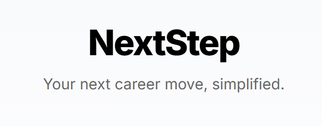

# NextStep - AI-Powered Job Matching Platform



NextStep is an **AI-powered job-matching platform** designed to simplify the job search process using a **swipe-based** interface, **semantic search**, and **intelligent recommendations**. It leverages **vector embeddings**, **resume analysis**, and **real-time tracking** to connect job seekers with employers efficiently.

###  Table of Contents
- [Overview](#overview)
- [Core Features](#core-features)
- [AI Capabilities](#ai-capabilities)
- [Technology Stack](#technology-stack)
- [Installation](#installation)
- [Configuration](#configuration)
- [Running the Application](#running-the-application)
- [API Endpoints](#api-endpoints)
- [Documentation](#documentation)
- [Contributing](#contributing)
- [License](#license)
---

### Overview 

**NextStep** is an intelligent job-matching application with a **swipe-based** interface that helps job seekers efficiently browse and apply for jobs. The platform uses **AI-powered semantic search** to match candidates with relevant opportunities based on their skills, experience, and preferences. Employers can post job listings, track applications, and connect with candidates in real time.

### **Core Features** 
- **Swipe-Based Job Discovery** – Browse jobs with an intuitive swipe/scroll experience inspired by popular apps
- **AI-Powered Semantic Search** – Find jobs using natural language queries with vector similarity matching
- **Intelligent Job Recommendations** – Personalized job suggestions based on your profile using cached embeddings
- **AI Resume Analysis** – Automatic skill extraction and job title recommendations from uploaded resumes
- **One-Click Apply** – Apply instantly with stored profile and resume
- **Real-Time Application Tracking** – Monitor job application statuses and updates
- **Employer Dashboard** – Post jobs, review candidates, and manage applications
- **Integrated Messaging** – Direct communication between job seekers and employers
- **Company Profiles** – Detailed company information and branding
- **Email Verification** – Secure account verification system
- **Google OAuth** – Quick sign-in with Google accounts
- **AI Help Chat** – Interactive chatbot for platform assistance

---

### **AI Capabilities**

NextStep leverages multiple AI technologies to enhance the job matching experience:

#### **Semantic Job Search**
- **Vector Embeddings**: Jobs and user profiles are converted to 1536-dimensional vectors using OpenAI's `text-embedding-3-small` model
- **MongoDB Atlas Vector Search**: Efficient similarity search across thousands of job postings
- **Natural Language Queries**: Search using phrases like "remote software engineer with Python experience in NYC"
- **Intelligent Query Parsing**: AI extracts locations, salary ranges, skills, and requirements from search text
- **Match Refinement**: GPT-4o-mini analyzes and ranks results as "poor/good/great" matches with explanations

#### **Resume Intelligence**
- **Automated Resume Analysis**: OpenAI Assistants API with file search extracts skills and experience
- **Skill Extraction**: Identifies technical and soft skills from resume content
- **Job Title Recommendations**: Suggests appropriate job titles based on experience
- **Profile Auto-Population**: Automatically fills profile fields from resume data

#### **Personalized Recommendations**
- **Cached User Embeddings**: User skills and preferences are embedded once and cached for fast recommendations
- **Homepage Job Matching**: AI-powered job feed tailored to each user's profile
- **Score-Based Filtering**: Only shows jobs with similarity scores above 0.62 threshold
- **Performance Optimized**: No repeated API calls - embeddings cached in user profiles

#### **AI Chat Assistant**
- **Google Gemini Integration**: Powered by Gemini 1.5 Flash for fast, accurate responses
- **Context-Aware**: Understands NextStep features and provides relevant help
- **Markdown Support**: Rich formatted responses for better readability

---

### **Technology Stack** 

#### **Frontend**
- **Framework**: React.js (Web) / React Native (Mobile - planned)
- **Styling**: Custom CSS
- **React Router** – Frontend navigation
- **Axios** – API communication
- **React Markdown** – Formatted chat responses
- **React Icons** – UI iconography

#### **Backend**
- **Node.js** – Server-side runtime
- **Express.js** – Web framework and middleware
- **MongoDB Atlas** – Cloud NoSQL database with vector search capabilities
- **JWT (JSON Web Tokens)** – Secure authentication
- **Bcrypt** – Password hashing
- **Multer** – File upload handling
- **Jest** – Unit testing framework
- **JSDoc** – Code documentation

#### **AI & Machine Learning**
- **OpenAI API** – Resume analysis, embeddings, and query parsing
  - `text-embedding-3-small` – Vector embeddings (1536 dimensions)
  - `gpt-4o-mini` – Query parsing and match analysis
  - Assistants API with file search – Resume processing
- **Google Gemini** – Chat assistant
  - `gemini-1.5-flash` – Fast conversational AI
- **MongoDB Vector Search** – Semantic similarity search with approximate nearest neighbor

#### **Email & Authentication**
- **Google OAuth 2.0** – Social authentication
- **Crypto** – Token generation for email verification

#### **DevOps & Deployment**
- **Nodemon** – Development server with hot reload
- **dotenv** – Environment variable management
- **CORS** – Cross-origin resource sharing
- Deployment platform: TBD

---

### **Installation** 
```bash
# 1 Clone the Repository
git clone https://github.com/drewstake/nextstep.git
cd nextstep

# 2 Install Backend Dependencies
cd server
npm install

# 3 Run server unit tests (you must be in server folder)
cd server
npm test
# Run unit tests with code coverage report (you must be in server folder)
npm run test:coverage 

# 4 Install Frontend Dependencies
cd ../src
npm install

# 5 Regenerate jsdocs (currently available only for server-side API code but must be run from the NextStep root folder where the README.md file is located)
# Notice: JSdoc is a global install. Hence, must be installed separately.
npm install -g jsdoc
jsdoc -c jsdoc.json
```

---

### **Configuration**
Before running the app, configure the environment variables.

#### Frontend .env File
```bash
REACT_APP_BACKEND_URL=http://localhost:4000
```

#### Backend .env File (server/.env)
```bash
# Server Configuration
PORT=4000
NODE_ENV=development
SERVER_DOMAIN=http://localhost:4000

# Database
MONGODB_URI=mongodb+srv://<username>:<password>@cluster0.mongodb.net/nextstep

# Authentication
JWT_SECRET=your_jwt_secret_key_here
GOOGLE_CLIENT_ID=your_google_oauth_client_id

# AI Services
OPENAI_API_KEY=your_openai_api_key
GEMINI_API_KEY=your_google_gemini_api_key

# Email Service (Optional - for notifications)
# EMAIL_FROM=noreply@nextstep.com

# Optional Services
TWILIO_ACCOUNT_SID=your_twilio_sid
TWILIO_AUTH_TOKEN=your_twilio_token
TWILIO_PHONE_NUMBER=your_twilio_phone
BAD_WORDS_API_KEY=your_content_filter_api_key
```

**Note**: MongoDB Atlas must have vector search index configured:
- Index name: `js_vector_index`
- Path: `embedding`
- Dimensions: 1536
- Similarity: cosine

---

### **Running The Application**
```bash
# 1 Start Backend
cd server
npm start

Server will run on http://localhost:4000

# 2 Start Frontend
cd ..
npm start

Frontend will run on http://localhost:3000
```

---

### **API Endpoints**

#### Authentication
| Method | Endpoint | Description |
|--------|----------|-------------|
| POST | /api/signup | Register new user with email verification |
| POST | /api/signin | Authenticate user (email/password) |
| POST | /api/auth/google | Google OAuth authentication |
| GET | /api/auth/verify-email | Verify email address |
| POST | /api/resend-verification | Resend verification email |
| GET | /api/logout | Logout current user |

#### Jobs
| Method | Endpoint | Description |
|--------|----------|-------------|
| GET | /api/jobs | Browse all jobs with optional search (semantic or keyword) |
| GET | /api/jobs/:jobId | Get single job details with company info |
| GET | /api/newJobs | Get jobs user hasn't applied to (requires auth) |
| GET | /api/retrieveJobsForHomepage | AI-powered personalized job recommendations |
| POST | /api/jobs | Create new job posting (employers only) |
| PUT | /api/employer/jobs/:jobId | Update job posting (employers only) |
| DELETE | /api/employer/jobs/:jobId | Delete job posting (employers only) |
| GET | /api/employer/jobs/search | Search employer's own job postings |

#### Applications
| Method | Endpoint | Description |
|--------|----------|-------------|
| POST | /api/jobsTracker | Track job application (apply/skip/ignore) |
| GET | /api/applications | Get user's applications with status |
| GET | /api/employer/applications | Get applications for employer's jobs |
| PUT | /api/employer/applications/:id | Update application status |
| GET | /api/employer/applications/:id | Get detailed application info |
| GET | /api/getallappl | Get all applications (admin) |

#### Profile & Resume
| Method | Endpoint | Description |
|--------|----------|-------------|
| GET | /api/profile | Get current user's profile |
| POST | /api/updateprofile | Update profile with photo/resume upload |
| POST | /api/analyze-resume | AI-powered resume analysis (extracts skills) |
| GET | /api/userProfile/:userId | Get public user profile |
| GET | /api/users | Get all users (for messaging) |

#### Messaging
| Method | Endpoint | Description |
|--------|----------|-------------|
| GET | /api/messages | Get messages between users |
| POST | /api/messages | Send message to another user |
| POST | /api/messages/company | Send message to company |
| PUT | /api/messages/read/:contactId | Mark messages as read |
| GET | /api/myRecentContacts | Get recent message contacts |
| GET | /api/employersFromApplications | Get employers from applications |

#### Employer Messaging
| Method | Endpoint | Description |
|--------|----------|-------------|
| GET | /api/employer/messages | Get employer's messages |
| POST | /api/employer/messages | Send message to applicant |
| PUT | /api/employer/messages/read/:applicantId | Mark messages as read |
| GET | /api/employer/recent-applicant-contacts | Get recent applicant contacts |
| GET | /api/employer/applicants | Get applicants from jobs |

#### Company
| Method | Endpoint | Description |
|--------|----------|-------------|
| GET | /api/company/:companyId | Get company profile |
| POST | /api/company | Create company profile |
| PUT | /api/company/:companyId | Update company profile |

#### AI Chat
| Method | Endpoint | Description |
|--------|----------|-------------|
| POST | /api/chat | Send message to AI chatbot, get response |
| POST | /api/rag-chat | Send message to RAG chatbot with sources |
| POST | /api/rag-chat/feedback | Submit feedback (👍/👎) for chatbot response |
| GET | /api/rag-chat/status | Check RAG service status |

---

### **Documentation**

📚 **All documentation is in [`server/docs/`](./server/docs/)** - This is what the RAG chatbot uses!

#### For Users
- **[FAQ](./server/docs/faq.md)** - Frequently asked questions
- **[User Guides](./server/docs/user-guides/)** - How to use NextStep
  - [How to Apply to Jobs](./server/docs/user-guides/how-to-apply-jobs.md)
  - [How to Withdraw Application](./server/docs/user-guides/how-to-withdraw-application.md)
  - [How to Create Profile](./server/docs/user-guides/how-to-create-profile.md)
  - [How to Search Jobs](./server/docs/user-guides/how-to-search-jobs.md)
  - [How to Message Employers](./server/docs/user-guides/how-to-message-employers.md)

#### For Employers
- **[Employer Guides](./server/docs/employer-guides/)** - How to hire on NextStep
  - [How to Post Jobs](./server/docs/employer-guides/how-to-post-jobs.md)
  - [How to Review Applications](./server/docs/employer-guides/how-to-review-applications.md)

#### 🤖 RAG Chatbot
- **[Self-Improving RAG System](./server/docs/SELF_IMPROVING_RAG.md)** ⭐ - How the chatbot learns from feedback
- **[Recent Improvements](./server/docs/IMPROVEMENTS_COMPLETED.md)** - Latest features
- **[RAG Improvements Roadmap](./server/docs/RAG_IMPROVEMENTS.md)** - Future enhancements
- **[RAG System Guide](./server/docs/RAG_SYSTEM_GUIDE.md)** - Technical documentation

#### For Developers
- **[Quick Start Guide](./server/docs/QUICK_START.md)** - Get up and running
- **[Project Structure](./server/docs/PROJECT_STRUCTURE.md)** - Codebase organization
- **[Docker Setup](./server/docs/DOCKER_SETUP.md)** - Containerization
- **[ChromaDB Setup](./server/docs/CHROMADB_SETUP.md)** - Vector database
- **[AWS Deployment](./server/docs/AWS_DEPLOYMENT.md)** - Production deployment
- **[Server README](./server/README.md)** - Backend documentation

#### Reference
- **[Requirements](./docs/requirements.md)** - Original project requirements
- **[System Diagrams](./docs/all-diagrams-source-files/)** - Architecture diagrams

---

### **Contributing**
We welcome contributions! Follow these steps:

- Fork the repository 
- Create a new branch (feature/your-feature-name)
- Commit your changes
- Push to your fork
- Submit a pull request

---

### **License**
This project is licensed under the MIT License.

---

### **Future Enhancements**
- RAG-powered chatbot with document knowledge base
- Enhanced real-time notifications
- Interview scheduling integration
- Mobile app (React Native)
- Advanced analytics dashboard
- Multi-language support
