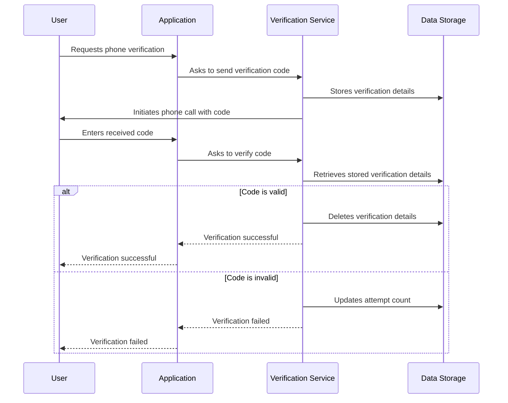

```mermaid
sequenceDiagram
    participant User
    participant Application
    participant Verification Service
    participant Data Storage

    User->>Application: Requests phone verification
    Application->>Verification Service: Asks to send verification code
    Verification Service->>Data Storage: Stores verification details
    Verification Service->>User: Initiates phone call with code
    User->>Application: Enters received code
    Application->>Verification Service: Asks to verify code
    Verification Service->>Data Storage: Retrieves stored verification details
    alt Code is valid
        Verification Service->>Data Storage: Deletes verification details
        Verification Service-->>Application: Verification successful
        Application-->>User: Verification successful
    else Code is invalid
        Verification Service->>Data Storage: Updates attempt count
        Verification Service-->>Application: Verification failed
        Application-->>User: Verification failed
    end
```